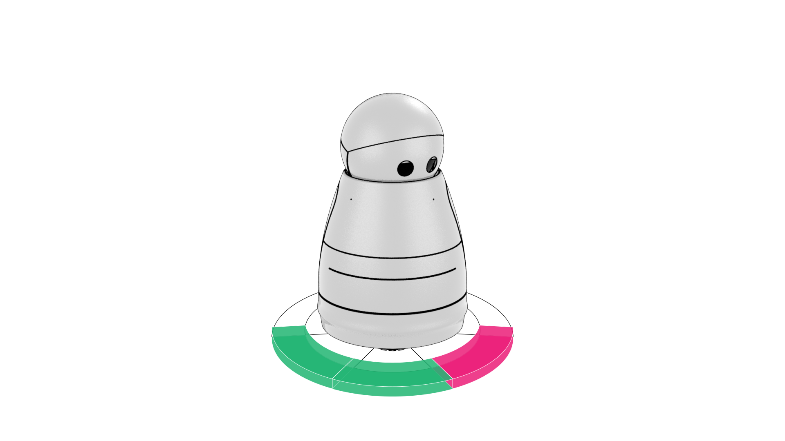
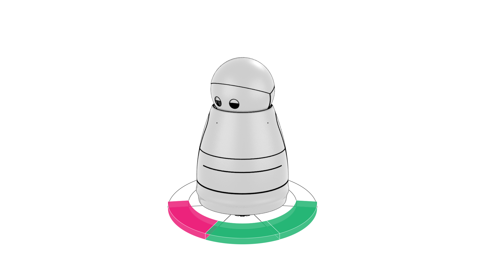

## Have Kuri react to bumps

Kuri can look down and to the left, down and to the right, or straight down
when bumped to make Kuri seem more lifelike

### Background

The node that controls Kuri's head doesn't do anything beyond making the head
look up and opening the eyes at startup.  To make Kuri seem more alive, the
head controller could be enhanced to play a simple animation when kuri bumps

There is already a SafetyMonitor class in the mobile_base software package 
which can monitor for bumps and call a method when a bump happens

```
import mobile_base

monitor = mobile_base.SafetyMonitor()

# You can hook up a callback method that will be called
# when a new safety status happens:

def safety_status_callback(status):
    ```
    Status is a list of safety sensors that triggered the reaction.
    "BPR_bp" = Right Bump
    "BPM_bp" = Middle Bump
    "BPL_bp" = Left Bump
    ```
    if "BPR_bp" in status:
        # Do a reaction . . .

monitor.safety_event.connect(safety_status_callback)
```
It helps communicate why kuri is reacting if the robot looks towards the
direction that the bump came from



The head controller uses the HeadClient.pan_and_tilt method to send
the head to a specific point at startup, but the HeadClient also has
a method for stringing together multiple points into an animation.  For 
example, to have Kuri look down and up as a single action:

```
import trajectory_msgs.msg

# The first point of the trajectory looks down.  All of the joints
# are position controlled, so the velocity, acceleration, and effort
# parameters are not used:
down_point = trajectory_msgs.msg.JointTrajectoryPoint(
    positions=[HeadClient.PAN_NEUTRAL, HeadClient.TILT_DOWN],
    velocities=[],
    accelerations=[],
    effort=[],
    time_from_start=0.4
)

up_point = trajectory_msgs.msg.JointTrajectoryPoint(
    positions=[HeadClient.PAN_NEUTRAL, HeadClient.TILT_UP],
    velocities=[],
    accelerations=[],
    effort=[],
    time_from_start=0.8
)

trajectory = trajectory_msgs.msg.JointTrajectory(
    joint_names=[HeadClient.JOINT_PAN, HeadClient.JOINT_TILT],
    points=[down_point, up_point]
)

# Send the trajectory to the mobile base driver.  Kuri will look down
# then back up.
head_client.send_trajectory(trajectory)
```

Relevant HeadClient constants:
```
    PAN_LEFT
    PAN_NEUTRAL
    PAN_RIGHT

    TILT_UP
    TILT_NEUTRAL
    TILT_DOWN
```

### Activity:

Add a StatusMonitor and hook the safety_event up to a callback which will
play a reaction when Kuri bumps.  The example above shows a head trajectory
with two points (down and back up) but you might want to add a few more points
so that kuri looks down for a short time before moving the head back up.  It
may take a little tuning to get the animation to look good

Potential Pitfalls:
  - If Kuri reacts to every bump, it can get annoying - especially if
reactions start to play on top of one-another.  Consider recording the time
of the last bump and not reacting if fewer than 5 seconds have elapsed.  See 
http://wiki.ros.org/rospy/Overview/Time for an overview of time in ROS
  - If the time_from_start specified in a joint trajectory is too small, the
underlying joint trajectory controller may have trouble keeping up.  This may
cause reactions to look jerky
